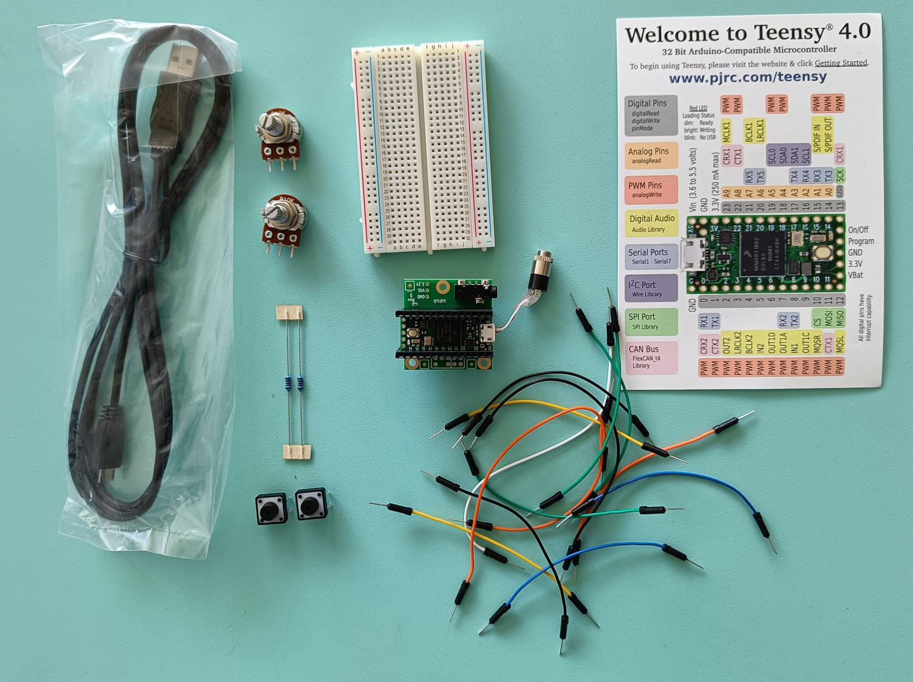

# ECIU University Micro-Module

## Embedded Real-Time Audio: Digital Signal Processing for Embedded Applications

Embedded real-time audio systems can be found everywhere: headphones, cars, musical instruments, TVs, sound systems, concert halls, movie theaters, hearing aids, etc.

In this course, students program an embedded system (the Teensy 4.0: <https://www.pjrc.com/store/teensy40.html>) for real-time audio signal processing applications. By doing so, they learn the basics of audio software architecture, audio signal processing in C++, and embedded system programming (C++). The idea is also to encourage students to develop a sense of independent work/entrepreneurship.

The course starts with a workshop on embedded real-time audio signal processing. During that period, students are walked through the architecture of a real-time audio DSP system (e.g., audio callback, buffering, sampling, etc.), and learn various basic techniques for audio signal processing (e.g., filters, oscillators, sound synthesis techniques, sound processing techniques, sound analysis techniques, etc.) taking a very practical approach.

After this period, various project ideas are suggested to students and tudents work in groups of 2 on projects. The project period culminates in a final presentation taking the form of an oral presentation.

Students are provided with plenty of fully-operational starter code/projects so that they have "something that works" right from the beginning.

## Instructor

* [Romain Michon](http://perso.citi-lab.fr/rmichon/) (INSA-Lyon // Inria)

## Resources

* Course GitHub Repository: <https://github.com/inria-emeraude/son-eciu>
* Teensy Audio Library: <https://www.pjrc.com/teensy/td_libs_Audio.html>
* The SON kit for a group of two students:
* **[Some Useful Things to Know](lectures/useful.md)**

<figcaption>A pair of headphones, one Teensy 4.0 with its companion audio shield, two buttons, two potentiometers, one breadboard, and a couple of resistors and jumper cables (do not loose these components!).
</figcaption>

## Requirements

* Installing Teensyduino as explained in [Lecture 2](lectures/setup.md).

## Course Overview

* **Lecture 1: [Course Introduction and Programming Environment Setup](lectures/setup.md)**
* **Lecture 2: [Audio Signal Processing Fundamentals](lectures/audio-dsp.md)**
* **Lecture 3: [Digital Audio Systems Architectures and Audio Callback](lectures/audio-sys.md)** 
* **Lecture 4: [Hardware Control and Audio Codec Configuration](lectures/control.md)**
* **Lecture 5: [Introduction to Faust](lectures/faust.md)**
* **Lecture 6: [Audio Processing Basics I](lectures/dsp1.md)** 
* **Lecture 7: [Audio Processing Basics II](lectures/dsp2.md)**
* **Lecture 8: [Faust on the Teensy and Advanced Control](lectures/faust-teensy.md)**
* **Independent work on Projects**
* **Final Presentation**

